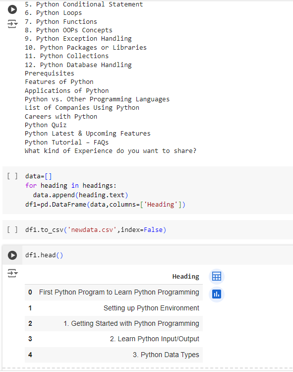

# EX02-Webscrapping 
## NAME: SREEVALSAN
## REGISTER NO: 212223240158
## AIM:
To Perform Data Collection through web scraping using python.


## ALGORITHM:
	Step 1: Include the Necessary python libraries.
 
	Step 2: Use the requests library to send HTTP requests to a web page.
 
	Step 3: Retrieve the HTML content and use BeautifulSoup to parse it.
 
	Step 4: Navigate and extract the necessary data.
 
	Step 5: Handle the Java script content and retrieve the data using the html tags.
 
	Step 6: Check with the website permission and scrap the content.

## CODING AND OUTPUT:
```PY
pip install beautifulsoup4 requests

import requests
from bs4 import BeautifulSoup
import pandas as pd
url = 'https://www.w3schools.com/html/html_tables.asp'
response = requests.get(url)
html_content = response.text

response

html_content

soup = BeautifulSoup(html_content, 'html.parser')

headings=soup.find_all('h2')
for heading in headings:
  print(heading.text)

data=[]
for heading in headings:
  data.append(heading.text)
df=pd.DataFrame(data,columns=['Heading'])

df.to_csv('newdata.csv',index=False)

df.head()

url = 'https://www.geeksforgeeks.org/python-programming-language-tutorial/'
response = requests.get(url)
soup = BeautifulSoup(response.text, 'html.parser')


headings=soup.find_all('h2')
for heading in headings:
  print(heading.text)

data=[]
for heading in headings:
  data.append(heading.text)
df1=pd.DataFrame(data,columns=['Heading'])

df1.to_csv('newdata.csv',index=False)
df1.head()
```




## RESULT:

Thus , data Collection through web scraping using python is successfully performed